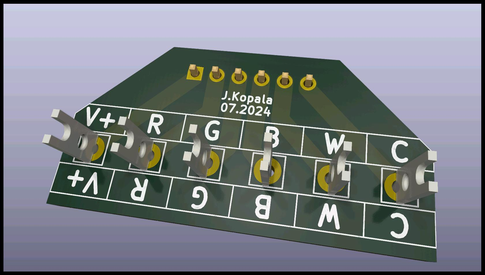
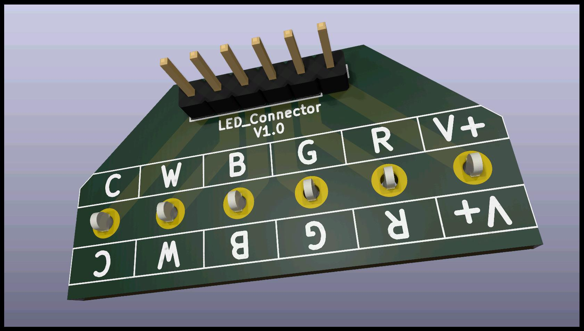

# ledConnector

Small connector PCB designed for noname ZigBee controller (version RGBCW): [this one](https://pl.aliexpress.com/item/1005005634005243.html?srcSns=sns_Copy&spreadType=socialShare&bizType=ProductDetail&social_params=60811259683&aff_fcid=368de0fa499b440092f7d4af70d54110-1727819655069-06785-_Ext7h7F&tt=MG&fbclid=IwY2xjawFpTtZleHRuA2FlbQIxMAABHa1f0QjnrHqwywSU5HHgteS7Dx3SYLz70TDuLomQzgZcnZJDuDSwwBwSYA_aem_xyvfc5u3CarVrbAd5t3e8g&aff_fsk=_Ext7h7F&aff_platform=default&sk=_Ext7h7F&aff_trace_key=368de0fa499b440092f7d4af70d54110-1727819655069-06785-_Ext7h7F&shareId=60811259683&businessType=ProductDetail&platform=AE&terminal_id=61640e1edf5442f1ac2230fec42363f5&afSmartRedirect=y)

